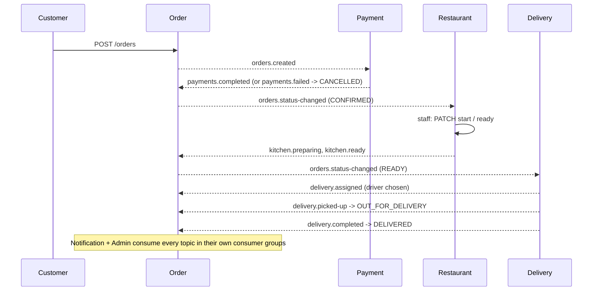

# Distributed Food Delivery Platform (DSA612S – Assignment 2)

Seven Ballerina microservices coordinated through Kafka, each with its own MongoDB database, orchestrated with Docker Compose, plus a web UI, live driver simulation, A* route optimisation, surge pricing and Prometheus/Grafana monitoring.


## Architecture

```mermaid
flowchart LR
    C[Customer / Driver / Restaurant clients] -->|REST| CS[Customer Service :8081]
    C -->|REST| RS[Restaurant Service :8082]
    C -->|REST| OS[Order Service :8083]
    C -->|REST| DS[Delivery Service :8085]
    C -->|REST| AS[Admin Service :8087]

    OS <--> K[(Kafka)]
    PS[Payment Service :8084] <--> K
    RS <--> K
    DS <--> K
    CS <-- K
    NS[Notification Service :8086] <-- K
    AS <-- K

    CS --- DB1[(customer_db)]
    RS --- DB2[(restaurant_db)]
    OS --- DB3[(order_db)]
    PS --- DB4[(payment_db)]
    DS --- DB5[(delivery_db)]
    NS --- DB6[(notification_db)]
    AS --- DB7[(admin_db)]
```

## Order lifecycle (event choreography)



## Kafka topics

All topics have 3 partitions. Every message is keyed by `orderId`, so all events for one order go to the same partition and are consumed in order, while different orders are processed in parallel (up to 3 instances per consumer group).

| Topic | Producer | Consumers |
|---|---|---|
| orders.created | Order | Payment, Notification, Admin |
| orders.status-changed | Order | Restaurant, Delivery, Customer, Payment (refunds), Notification, Admin |
| payments.completed / payments.failed / payments.refunded | Payment | Order, Notification |
| kitchen.preparing / kitchen.ready | Restaurant | Order, Notification |
| delivery.assigned / delivery.picked-up / delivery.completed | Delivery | Order, Notification, Admin |
| driver.location (keyed by driverId) | Delivery (simulator) | Admin, Notification (optional) |
| drivers.availability | Delivery | Order (surge pricing) |
| events.dlq | any | (manual inspection) |

Each service uses its own consumer group id (its service name), so every service receives every event it subscribes to (publish/subscribe), while replicas of the *same* service share the load.

## Data model (one database per service)

| Service | Collections (key fields) |
|---|---|
| Customer | customers {customerId, name, email, phone, addresses[]}, orderHistory {customerId, orderId, status, total, updatedAt} |
| Restaurant | restaurants {restaurantId, name, openingHours{day: {open, close}}, isOpen}, menuItems {menuItemId, restaurantId, name, price, stock, available} |
| Order | orders {orderId, customerId, restaurantId, items[], total, status, history[], createdAt} |
| Payment | payments {paymentId, orderId, amount, status, method, processedAt} |
| Delivery | drivers {driverId, name, status: AVAILABLE/BUSY/OFFLINE, location{lat, lng}}, deliveries {deliveryId, orderId, driverId, status, assignedAt, deliveredAt} |
| Notification | notifications {notificationId, recipientType, recipientId, channel, message, sentAt} |
| Admin | orderStats {restaurantId, ordersCount, revenue, avgPrepMinutes}, deliveryStats {driverId, deliveries, avgDeliveryMinutes} |

Data shared between services (e.g. customer name on an order) is copied via events rather than read from another service's database.

## REST API contract

The web UI (served at http://localhost:8080) calls every service through nginx at `/api/<service>/...`, so each service must expose these routes and JSON shapes. Fields marked `?` are optional.

| Service | Method & path | Returns / body |
|---|---|---|
| Customer | `POST /customers`, `GET /customers/{id}`, `GET /customers/{id}/orders` | customer, order history |
| Restaurant | `GET /restaurants` | `[{restaurantId, name, nodeId, isOpen}]` |
| Restaurant | `GET /restaurants/{id}/menu` | `[{menuItemId, name, price, stock, available}]` |
| Restaurant | `PATCH /kitchen/orders/{orderId}/start`, `.../ready` | emits `kitchen.preparing` / `kitchen.ready` |
| Order | `POST /orders`, `GET /orders?customerId=&restaurantId=&status=`, `GET /orders/{id}`, `POST /orders/{id}/cancel` | Order (implemented) |
| Order | `GET /orders/quote?subtotal=` | surge `PriceQuote` (implemented) |
| Payment | `GET /payments/{orderId}` | payment |
| Delivery | `GET /routes/nodes` | `Node[]` from routing.bal (`allNodes()`) |
| Delivery | `GET /routes?from=&to=` | `Route` (`shortestRoute()`) |
| Delivery | `GET /drivers`, `POST /drivers` | `[{driverId, name, status}]`; call `placeDriver()` on create |
| Delivery | `PATCH /drivers/{id}/availability` body `{status}` | AVAILABLE / OFFLINE; publish `drivers.availability` `{available}` |
| Delivery | `GET /drivers/locations` | `getDriverLocations()` from simulator.bal |
| Delivery | `GET /deliveries?driverId=`, `GET /deliveries/order/{orderId}` | `{deliveryId, orderId, driverId, status: ASSIGNED/PICKED_UP/DELIVERED, routeToRestaurant, routeToCustomer, etaMinutes}` |
| Delivery | `PATCH /deliveries/{id}/pickup`, `.../complete` | emits `delivery.picked-up` / `delivery.completed` |
| Notification | `GET /notifications?recipientId=` | `[{message, channel, sentAt}]` |
| Admin | `GET /reports/restaurants` | `[{restaurantId, name?, ordersCount, revenue, avgPrepMinutes}]` |
| Admin | `GET /reports/drivers` | `[{driverId, name?, deliveries, avgDeliveryMinutes}]` |

## Bonus features

**Surge pricing** (`order-service/pricing.bal`): the delivery fee is a base N$25 times a multiplier. The multiplier grows when there are more than 2 recent orders per available driver (sliding 15-minute window), during Windhoek peak meal hours, and when no drivers are free, capped at 2.5x. Customers see a live quote before checkout.

**Route optimisation** (`delivery-service/routing.bal`): A* search over a 17-node, 27-road Windhoek graph weighted by travel time (distance / speed limit). The haversine heuristic at max road speed is admissible, so routes are optimal (verified against Dijkstra on all node pairs). `bestDriver()` dispatches the available driver with the lowest ETA to the restaurant.

**Driver location simulation** (`delivery-service/simulator.bal`): drivers move along their A* route once per second (20x time-lapse), publishing to `driver.location` and updating the live map. Suggested wiring in Delivery Service: on `READY` → `bestDriver()` → `simulateTrip(..., "TO_RESTAURANT")`; on pickup → `simulateTrip(..., "TO_CUSTOMER", onArrive)` where `onArrive` completes the delivery.

**Complete UI** (`ui/`): one-page web app with Customer (browse, cart, surge quote, order timeline, live tracking, notifications), Restaurant (kitchen board), Driver (availability, delivery actions, navigation map) and Admin (live fleet map, reports, monitoring links) views.

**Observability** (`observability/`): every service exposes Ballerina metrics on `:9797`; Prometheus scrapes them and Grafana auto-loads the "Food Delivery Platform" dashboard (service health, request/event rate, latency, errors, in-flight requests). Each service needs `import ballerinax/prometheus as _;`, `observabilityIncluded = true` and the provided `Config.toml`.
